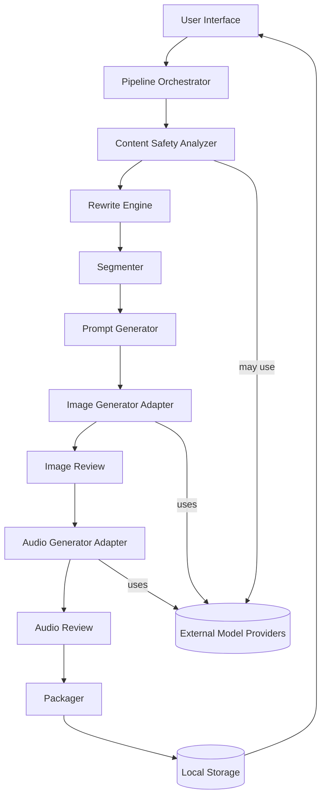
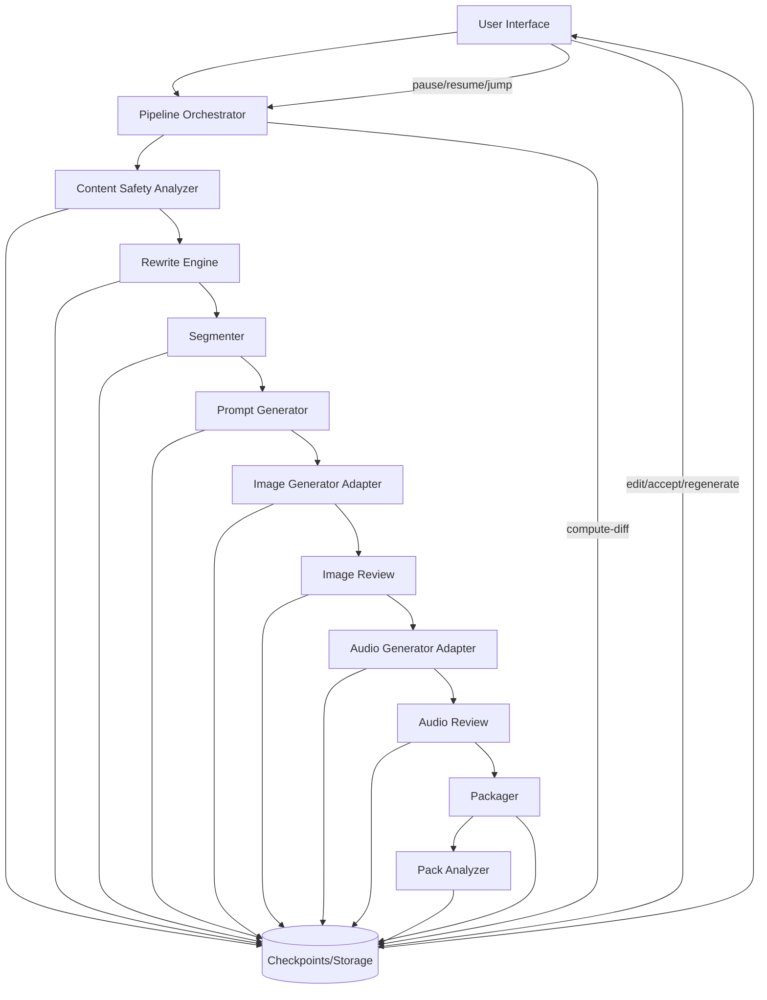

# Story Creator — Architecture

This document describes the architecture for the Story Creator AI pipeline app. It is implemented as a desktop macOS app (Flutter or SwiftUI) that runs an internal orchestrator and adapters for LLM, image, and audio providers.

## High-level Components
- UI Layer — Editor, pipeline dashboard, per-step review and asset manager.
- Pipeline Orchestrator — Manages the workflow state machine and job queue.
- Modules / Services:
  - Content Safety Analyzer
  - Rewrite Engine
  - Segmenter
  - Prompt Generator (for images)
  - Image Generation Adapter
  - Audio Generation Adapter
  - Packager
- Storage — Local filesystem storage for projects, assets, and manifests.
- Provider Adapters — pluggable connectors to API or local runtimes (LLM, SD, TTS).

## Data Flow (Simplified)



## Orchestrator & Persistence
- The `Pipeline Orchestrator` is the central stateful controller. It implements a state machine for the workflow and an async job queue. Key responsibilities:
  - Persist step inputs/outputs and user decisions as checkpoints in `Storage` (artifact + metadata + revision id).
  - Track a directed dependency graph between steps/artifacts so that a change at step N marks downstream steps (N+1..end) as stale and eligible for re-run.
  - Support pausing and resuming: when paused, running jobs are stopped cleanly and the orchestrator preserves the last consistent checkpoint. On resume, jobs continue from the next pending step.
  - Provide an API for the UI to: start workflow, pause, resume, jump-to-step, accept/reject artifacts, edit artifacts in-place, and request re-generation of downstream steps.

### Retry, prompts and run-time overrides
- Retry semantics: the orchestrator must expose a safe `retry` operation for any failed step. A retry attempt records the attempt metadata (timestamp, reason, parameters changed), uses the same input checkpoint by default, and creates a new attempt checkpoint on success or failure. Retries that succeed replace the previous failed attempt in the accepted timeline; failed retries remain in history.
- Per-step prompt storage: the orchestrator stores a `promptTemplate` and an active `promptText` for every LLM-powered step. `promptTemplate` contains the canonical prefilled prompt; `promptText` contains the exact prompt used for a particular run (which may be an edited override). Both are stored in checkpoints and in project-level settings.
- Prompt override API: UI and CLI can update `promptText` before running a step; these overrides are recorded and shown in the artifact history so generations are reproducible and auditable.

## Checkpointing and Rerun Semantics
- Checkpoint model: each step completion writes a checkpoint object: `{stepId, inputsRef, outputsRef, acceptedByUser, timestamp, parentCheckpointId}`.
- Rerun logic: when the user jumps back to step K and accepts a modified result, orchestrator computes the minimal set of downstream steps to re-execute by walking the dependency graph starting from outputs of K. Steps before K are not re-executed.
- Versioning: artifacts include `revision` metadata so UI shows history and allows revert.

### Model & runtime choices (declared)
- LLM runtime (preferred): `llama.cpp` / GGML backends for local inference of quantized Llama-family or compatible models. These provide an offline, local runtime that is suitable for safety analysis, segmentation, rewrite candidates and blurb generation. The orchestrator supports selecting a different local model binary per project and per-step.
- Image generation (preferred): Stable Diffusion family via `diffusers` with CoreML/MPS acceleration on macOS (or a configured local SD backend). The architecture supports selecting SD model variants (1.5, 2.x, SDXL) depending on hardware capability and licensing.
- TTS (preferred): start with macOS built-in TTS for fast, offline narration, and add local open-source TTS options such as Coqui TTS / VITS / Larynx for higher-quality voices. The orchestrator will treat TTS providers as pluggable adapters.

### Licensing & App Store compatibility
- Use only models and checkpoints whose licenses permit local use and distribution consistent with your goals. Avoid using model checkpoints with restrictive or unknown licenses for any content you intend to ship in an app distributed via the Apple App Store, Google Play, or Kindle Store.
- Recommended approach: prefer permissively licensed or explicitly permit-local-use checkpoints (and document each chosen model's license in project settings). For user-generated content that will be distributed, require that the operator confirm licensing for source text and model outputs.
- Offline/local-first toolchain reduces exposure to third-party terms; still verify the checkpoints and libraries you bundle to ensure App Store/Play Store guidelines are satisfied.

## UI Responsibilities (detailed)
- Review panels for each step (analysis, rewrite, segmentation, image gallery, audio player) that show generated results and provide: `Edit`, `Accept`, `Reject`, `Regenerate`, and `History` controls.
- Workflow timeline view showing which steps are completed, paused, or stale (needing re-generation after an upstream change).
- Per-step editors: text editor with diff view, image selector/replace UI, audio preview and replace controls.

## Mermaid: workflow with checkpoints (updated)



## Module Responsibilities
- Content Safety Analyzer
  - Input: full story text
  - Output: list of flagged spans {start, end, sentenceIndex, category, severity, snippet}
  - Implementation: LLM classification + lightweight rule-based checks.

- Rewrite Engine
  - Input: flagged span + surrounding context + rewrite constraints
  - Output: multiple candidate rewrites with diffs and confidence
  - Implementation: LLM with controlled prompts, temperature and style presets.

- Segmenter
  - Input: approved/clean story text
  - Output: pages list where each page has 2–6 sentences and a focused theme
  - Implementation: deterministic LLM prompt or sentence-splitting with coherence scoring.

- Prompt Generator
  - Input: pageText
  - Output: short blurb (7–12 words) describing desired image
  - Implementation: templated LLM prompt or heuristics.

- Image/Audio Adapters
  - Provide: generate, list variations, metadata (seed, model, prompt)
  - Support both: local runtime (if available) and remote APIs with retries and rate-limit handling.

- Packager
  - Generate `story_manifest.json` and `pack_manifest.json` and create archive layout.

## Storage Layout (suggested)
```
/story/<story-id>/story_manifest.json
/story/<story-id>/pages/page-001.txt
/story/<story-id>/images/page-001.png
/story/<story-id>/audio/page-001.mp3
/pack/pack_manifest.json
```

## Interfaces / Contracts
- analyzeText(text) -> List<Flag>
- rewriteSpan(text, span, params) -> List<Candidate>
- segmentText(text, minSent, maxSent) -> List<Page>
- generateBlurb(pageText) -> String
 - generateBlurb(pageText, maxWords=10) -> String  # enforces maximum words for image prompt blurbs
 - suggestPackTitles(packId, n=5) -> List<String>
- generateImages(prompt, opts) -> List<ImageResult>
- generateAudio(text|SSML, opts) -> AudioResult
- packageStory(manifest, assets) -> archivePath
 - packAnalyze(packId) -> {packDescription, packKeywords, coverImagePrompt}
 - regeneratePackCover(packId, prompt) -> ImageResult
 - regeneratePackTitleSuggestions(packId) -> List<String>

## Security & Privacy
- Store API keys in macOS Keychain.
- Default to local-only operations; any upload requires explicit consent.
- Keep audit trail of rewrites and approvals in manifest metadata.

## Extensibility & Plugins
- Adapter interface for image/audio/LLM providers.
- Add provider configs (name, endpoint, auth, model) and expose provider selection per-project.

## Next Implementation Steps
1. Create project scaffold and manifest schemas.
2. Implement pipeline orchestrator & basic CLI for quick prototyping.
3. Wire LLM safety+rewrite via an API adapter (mockable for tests).
4. Add image/audio adapters and per-page reviewer UI.

