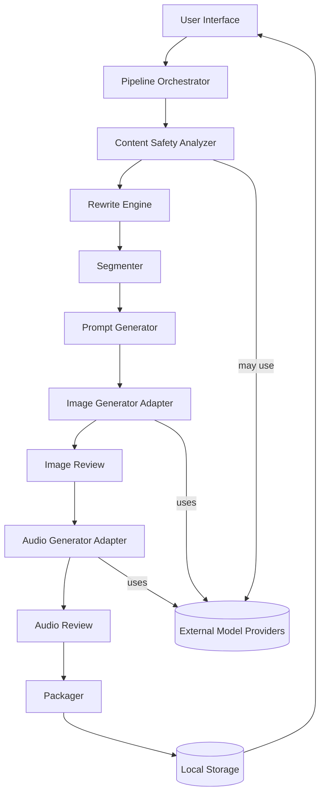

# Story Creator — Architecture

This document describes the architecture for the Story Creator AI pipeline app. It is implemented as a desktop macOS app (Flutter or SwiftUI) that runs an internal orchestrator and adapters for LLM, image, and audio providers.

## High-level Components
- UI Layer — Editor, pipeline dashboard, per-step review and asset manager.
- Pipeline Orchestrator — Manages the workflow state machine and job queue.
- Modules / Services:
  - Content Safety Analyzer
  - Rewrite Engine
  - Segmenter
  - Prompt Generator (for images)
  - Image Generation Adapter
  - Audio Generation Adapter
  - Packager
- Storage — Local filesystem storage for projects, assets, and manifests.
- Provider Adapters — pluggable connectors to API or local runtimes (LLM, SD, TTS).

## Data Flow (Simplified)



## Module Responsibilities
- Content Safety Analyzer
  - Input: full story text
  - Output: list of flagged spans {start, end, sentenceIndex, category, severity, snippet}
  - Implementation: LLM classification + lightweight rule-based checks.

- Rewrite Engine
  - Input: flagged span + surrounding context + rewrite constraints
  - Output: multiple candidate rewrites with diffs and confidence
  - Implementation: LLM with controlled prompts, temperature and style presets.

- Segmenter
  - Input: approved/clean story text
  - Output: pages list where each page has 2–6 sentences and a focused theme
  - Implementation: deterministic LLM prompt or sentence-splitting with coherence scoring.

- Prompt Generator
  - Input: pageText
  - Output: short blurb (7–12 words) describing desired image
  - Implementation: templated LLM prompt or heuristics.

- Image/Audio Adapters
  - Provide: generate, list variations, metadata (seed, model, prompt)
  - Support both: local runtime (if available) and remote APIs with retries and rate-limit handling.

- Packager
  - Generate `story_manifest.json` and `pack_manifest.json` and create archive layout.

## Storage Layout (suggested)
```
/story/<story-id>/story_manifest.json
/story/<story-id>/pages/page-001.txt
/story/<story-id>/images/page-001.png
/story/<story-id>/audio/page-001.mp3
/pack/pack_manifest.json
```

## Interfaces / Contracts
- analyzeText(text) -> List<Flag>
- rewriteSpan(text, span, params) -> List<Candidate>
- segmentText(text, minSent, maxSent) -> List<Page>
- generateBlurb(pageText) -> String
- generateImages(prompt, opts) -> List<ImageResult>
- generateAudio(text|SSML, opts) -> AudioResult
- packageStory(manifest, assets) -> archivePath

## Security & Privacy
- Store API keys in macOS Keychain.
- Default to local-only operations; any upload requires explicit consent.
- Keep audit trail of rewrites and approvals in manifest metadata.

## Extensibility & Plugins
- Adapter interface for image/audio/LLM providers.
- Add provider configs (name, endpoint, auth, model) and expose provider selection per-project.

## Next Implementation Steps
1. Create project scaffold and manifest schemas.
2. Implement pipeline orchestrator & basic CLI for quick prototyping.
3. Wire LLM safety+rewrite via an API adapter (mockable for tests).
4. Add image/audio adapters and per-page reviewer UI.

